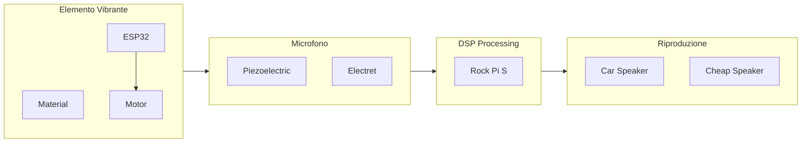
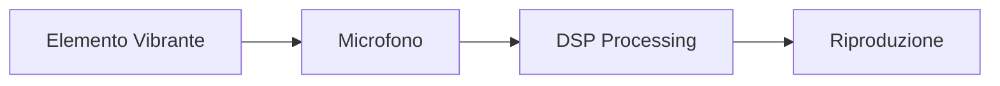
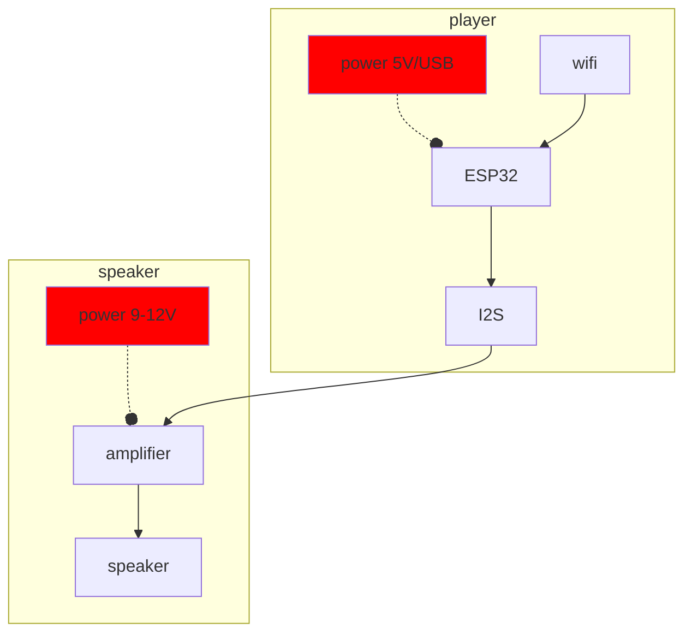
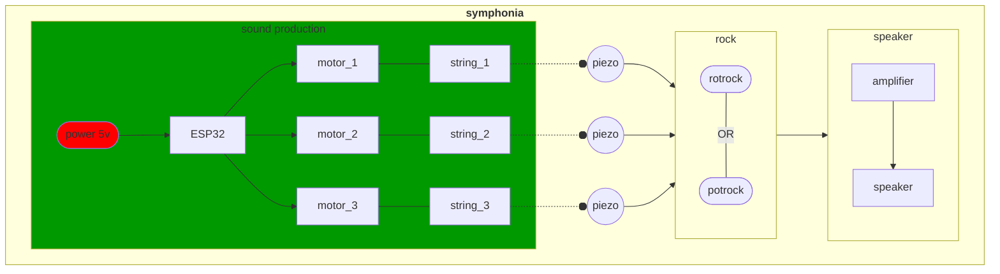
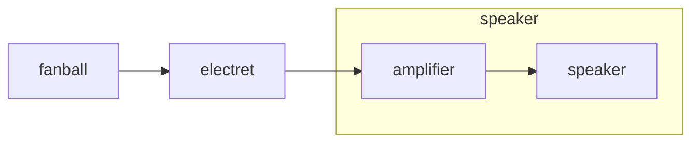
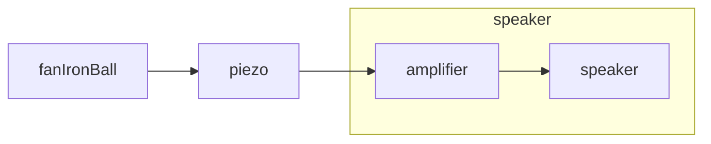
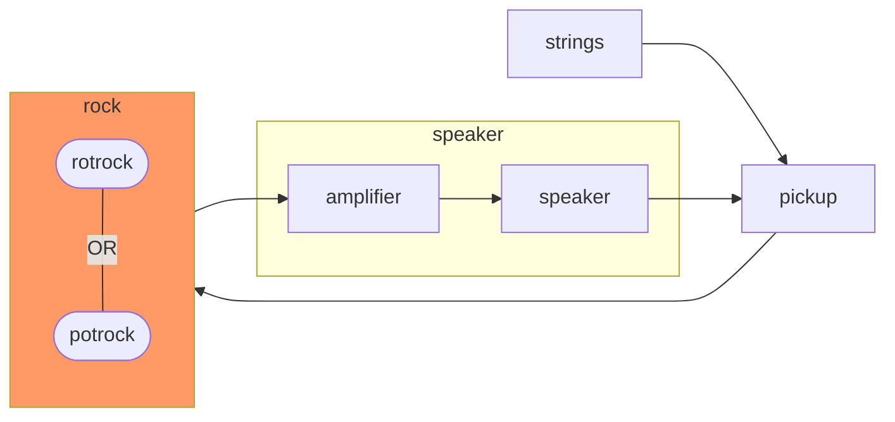
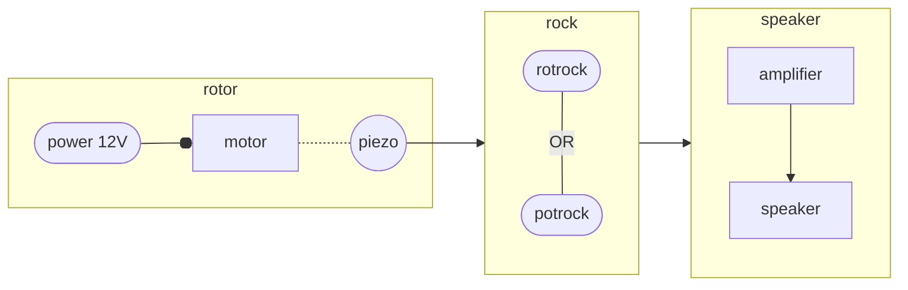
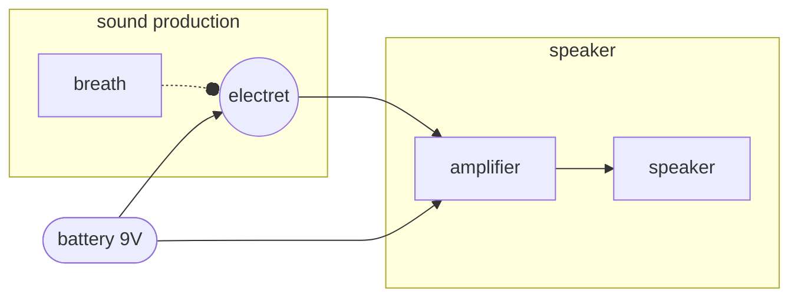

# Hortus Deliciarum

Orchestra di non-strumenti meccanizzati. Work in progress seguìto a una commissione del `To Listen To` Festival (settembre 2022). L'idea è quella di realizzare una serie di strumenti totalmente autocostruiti, sulla base della seguente catena strutturale:

## strumenti

1. player
2. symphonia
3. fan-ball
4. fan-ironball
5. table
6. guitar
7. rotor
8. mask

### player

### symphonia

### fan-ball

### fan-iron-ball

### table

### guitar

### rotor

### mask

