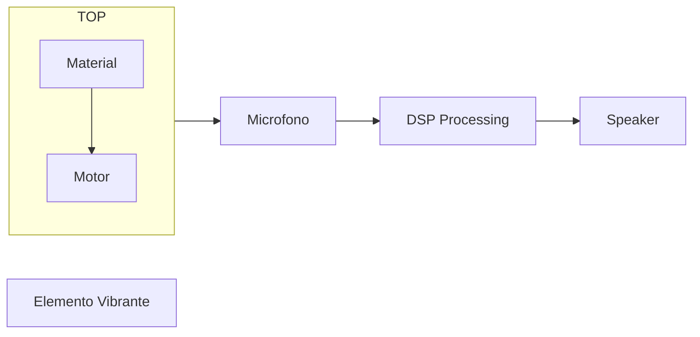

# Hortus Deliciarum

Orchestra di non-strumenti meccanizzati. Work in progress seguìto a una commissione del `To Listen To` Festival (settembre 2022). L'idea è quella di realizzare una serie di strumenti totalmente autocostruiti, sulla base della seguente catena strutturale:

